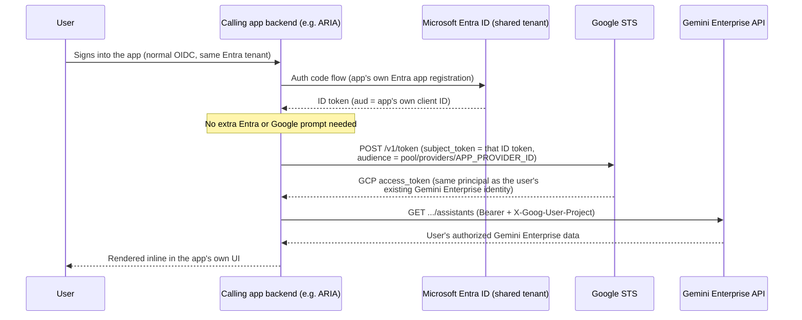

# Getting a Gemini Enterprise API token via Workforce Identity Federation (Microsoft Entra ID)

This guide is for an **end user or automation** at a customer organization who wants to call the Gemini Enterprise (Discovery Engine) API directly — from a script, service, or backend, with **no `gcloud` CLI or browser available** — using an existing Microsoft Entra ID corporate identity, authenticated through Google Cloud's Workforce Identity Federation (WIF).

It covers **only how to obtain and use the token**, entirely headlessly. It does not cover setting up Workforce Identity Federation itself.

## Prerequisites (already done by your administrator)

Before you can follow this guide, your GCP/IT administrator must have already:

1. Created a **workforce identity pool** and a **workforce identity pool provider** configured for Microsoft Entra ID (OIDC), in the same GCP organization as the project that runs Gemini Enterprise.
2. Granted your Entra ID identity (directly or via a group) the IAM roles needed to call the Gemini Enterprise API (e.g. Discovery Engine roles) on the target project, plus `roles/serviceusage.serviceUsageConsumer` (or an equivalent role containing `serviceusage.services.use`) on the **workforce-pool user project**.
3. Given you the following values (they're customer-specific — nothing below is a working default):
   - `WORKFORCE_POOL_ID` — the workforce identity pool ID
   - `WORKFORCE_PROVIDER_ID` — the workforce identity pool provider ID
   - `WORKFORCE_POOL_USER_PROJECT` — the project number/ID used for quota and billing of your WIF sign-ins
   - `PROJECT_NUMBER` — the project number of the GCP project running Gemini Enterprise (used later as the API's quota project; may be the same as `WORKFORCE_POOL_USER_PROJECT`)
   - `ENGINE_ID` / `LOCATION` — the Gemini Enterprise engine/app you're calling

If any of these don't exist yet, this guide isn't for you — ask your administrator to complete Google's [Workforce Identity Federation setup for Microsoft Entra ID](https://cloud.google.com/iam/docs/workforce-sign-in-microsoft-entra-id) first.

## Step 1: Get an Entra ID OIDC ID token

Obtain an **Entra ID–issued OIDC ID token** using whatever non-interactive method your organization uses for this identity — for example, an Entra ID app registration's client-credentials flow, an on-behalf-of exchange, or a managed-identity-backed call. This step is entirely on the Entra ID side; Google is not involved yet. The result is a JWT (`id_token`).

## Step 2: Exchange it for a Google Cloud access token

POST the Entra ID ID token to Google's Security Token Service (STS) to exchange it for a short-lived Google Cloud access token:

```bash
curl https://sts.googleapis.com/v1/token \
    --data-urlencode "audience=//iam.googleapis.com/locations/global/workforcePools/WORKFORCE_POOL_ID/providers/WORKFORCE_PROVIDER_ID" \
    --data-urlencode "grant_type=urn:ietf:params:oauth:grant-type:token-exchange" \
    --data-urlencode "requested_token_type=urn:ietf:params:oauth:token-type:access_token" \
    --data-urlencode "scope=https://www.googleapis.com/auth/cloud-platform" \
    --data-urlencode "subject_token_type=urn:ietf:params:oauth:token-type:id_token" \
    --data-urlencode "subject_token=ENTRA_ID_OIDC_TOKEN" \
    --data-urlencode "options={\"userProject\":\"WORKFORCE_POOL_USER_PROJECT\"}"
```

Replace `ENTRA_ID_OIDC_TOKEN` with the JWT from Step 1, and the other placeholders with the values from [Prerequisites](#prerequisites-already-done-by-your-administrator).

The response looks like:

```json
{
  "access_token": "ya29.dr.AaT61Tc6Ntv1ktbGkaQ9U_MQfiQw...",
  "issued_token_type": "urn:ietf:params:oauth:token-type:access_token",
  "token_type": "Bearer",
  "expires_in": 3600
}
```

`access_token` is your Google Cloud bearer token, valid for `expires_in` seconds (typically one hour). When it expires, repeat Step 1 and Step 2 with a fresh Entra ID ID token — there is no `gcloud` session to refresh; every renewal is this same two-step exchange.

## Step 3: Call the Gemini Enterprise API

Call the Gemini Enterprise (Discovery Engine) API directly with the access token. Two headers are required:

- `Authorization: Bearer <access_token>`
- `X-Goog-User-Project: PROJECT_NUMBER` — **required explicitly.** A Workforce Identity Federation principal typically has no GCP project associated with its credentials (unlike a user or service-account identity), so the API call must specify the billing/quota project itself rather than relying on it being inferred from the token.

Example — listing assistants for an engine:

```bash
ACCESS_TOKEN="<access_token from Step 2>"

curl -X GET \
  -H "Authorization: Bearer ${ACCESS_TOKEN}" \
  -H "X-Goog-User-Project: PROJECT_NUMBER" \
  "https://discoveryengine.googleapis.com/v1alpha/projects/PROJECT_NUMBER/locations/LOCATION/collections/default_collection/engines/ENGINE_ID/assistants"
```

Substitute `PROJECT_NUMBER`, `LOCATION`, and `ENGINE_ID` with the values from [Prerequisites](#prerequisites-already-done-by-your-administrator). Any other Gemini Enterprise/Discovery Engine REST endpoint your Entra ID identity is authorized for follows the same pattern — same two headers, different URL and body.

## Cross-Application Access (e.g. Embedding Gemini Enterprise Data in Another App)

If a second application — say an internal portal called ARIA — is federated through the **same Microsoft Entra ID tenant** and needs to show a signed-in user's Gemini Enterprise data inline, the user should never see a second sign-in prompt. The recommended setup:

- Your administrator creates a **second Workforce Identity Federation provider in the same workforce pool** used for Gemini Enterprise, with `--client-id` set to the calling application's own Entra ID app registration, and the **same `--attribute-mapping`** as the existing provider (e.g. both map `google.subject` from the same Entra claim, such as `assertion.oid`). Same pool + same mapping means the same human resolves to the same Google principal (`principal://iam.googleapis.com/locations/global/workforcePools/WORKFORCE_POOL_ID/subject/...`) no matter which application's provider they came through — so IAM access already granted for Gemini Enterprise applies automatically, with no separate consent step.
- The calling application's backend then reuses the ID token it already holds from its own normal Entra ID sign-in and runs [Step 2](#step-2-exchange-it-for-a-google-cloud-access-token) exactly as above — just pointed at its own provider's resource name as the `audience`.



The calling app's backend should perform this exchange server-side, cache the resulting token for its ~1-hour lifetime per signed-in user, and refresh by repeating the exchange — all silent to the user for as long as their Entra ID session stays valid.

If the calling application can't get its own provider added to the pool (a different admin domain owns it), fall back to an Entra ID On-Behalf-Of token exchange to mint a token for the existing provider's audience before handing it to STS — same STS call, one extra Entra-side hop, still no user-facing prompt.

## Ending a session

There is no persistent Google-side session to revoke. Simply stop requesting new Entra ID ID tokens and let the last-issued Google Cloud access token expire (within `expires_in` seconds of the last exchange).

## Further reading

- [Obtain short-lived tokens for Workforce Identity Federation](https://cloud.google.com/iam/docs/workforce-obtaining-short-lived-credentials) (Google's canonical reference for the STS REST call above)
- [Configure Workforce Identity Federation with Microsoft Entra ID](https://cloud.google.com/iam/docs/workforce-sign-in-microsoft-entra-id) (administrator setup — not needed if your admin has already done this)
</content>
<parameter name="i">Simplifying AUTHENTICATION.md to headless-only flow