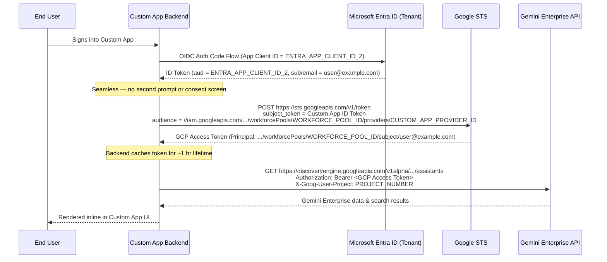

# Getting a Gemini Enterprise API token via Workforce Identity Federation (Microsoft Entra ID)

This guide is for an **end user or automation** at a customer organization who wants to call the Gemini Enterprise (Discovery Engine) API directly — from a script, service, or backend, with **no `gcloud` CLI or browser available** — using an existing Microsoft Entra ID corporate identity, authenticated through Google Cloud's Workforce Identity Federation (WIF).

It covers **only how to obtain and use the token**, entirely headlessly. It does not cover setting up Workforce Identity Federation itself.

## Prerequisites (already done by your administrator)

Before you can follow this guide, your GCP/IT administrator must have already:

1. Created a **workforce identity pool** and a **workforce identity pool provider** configured for Microsoft Entra ID (OIDC), in the same GCP organization as the project that runs Gemini Enterprise.
2. Granted your Entra ID identity (directly or via a group) the IAM roles needed to call the Gemini Enterprise API (e.g. Discovery Engine roles) on the target project, plus `roles/serviceusage.serviceUsageConsumer` (or an equivalent role containing `serviceusage.services.use`) on the **workforce-pool user project**.
3. Given you the following values (they're customer-specific — nothing below is a working default):
   - `WORKFORCE_POOL_ID` — the workforce identity pool ID
   - `WORKFORCE_PROVIDER_ID` — the workforce identity pool provider ID
   - `WORKFORCE_POOL_USER_PROJECT` — the project number/ID used for quota and billing of your WIF sign-ins
   - `PROJECT_NUMBER` — the project number of the GCP project running Gemini Enterprise (used later as the API's quota project; may be the same as `WORKFORCE_POOL_USER_PROJECT`)
   - `ENGINE_ID` / `LOCATION` — the Gemini Enterprise engine/app you're calling

If any of these don't exist yet, this guide isn't for you — ask your administrator to complete Google's [Workforce Identity Federation setup for Microsoft Entra ID](https://cloud.google.com/iam/docs/workforce-sign-in-microsoft-entra-id) first.

## Step 1: Get an Entra ID OIDC ID token

Obtain an **Entra ID–issued OIDC ID token** using whatever non-interactive method your organization uses for this identity — for example, an Entra ID app registration's client-credentials flow, an on-behalf-of exchange, or a managed-identity-backed call. This step is entirely on the Entra ID side; Google is not involved yet. The result is a JWT (`id_token`).

## Step 2: Exchange it for a Google Cloud access token

POST the Entra ID ID token to Google's Security Token Service (STS) to exchange it for a short-lived Google Cloud access token:

```bash
curl https://sts.googleapis.com/v1/token \
    --data-urlencode "audience=//iam.googleapis.com/locations/global/workforcePools/WORKFORCE_POOL_ID/providers/WORKFORCE_PROVIDER_ID" \
    --data-urlencode "grant_type=urn:ietf:params:oauth:grant-type:token-exchange" \
    --data-urlencode "requested_token_type=urn:ietf:params:oauth:token-type:access_token" \
    --data-urlencode "scope=https://www.googleapis.com/auth/cloud-platform" \
    --data-urlencode "subject_token_type=urn:ietf:params:oauth:token-type:id_token" \
    --data-urlencode "subject_token=ENTRA_ID_OIDC_TOKEN" \
    --data-urlencode "options={\"userProject\":\"WORKFORCE_POOL_USER_PROJECT\"}"
```

Replace `ENTRA_ID_OIDC_TOKEN` with the JWT from Step 1, and the other placeholders with the values from [Prerequisites](#prerequisites-already-done-by-your-administrator).

The response looks like:

```json
{
  "access_token": "ya29.dr.AaT61Tc6Ntv1ktbGkaQ9U_MQfiQw...",
  "issued_token_type": "urn:ietf:params:oauth:token-type:access_token",
  "token_type": "Bearer",
  "expires_in": 3600
}
```

`access_token` is your Google Cloud bearer token, valid for `expires_in` seconds (typically one hour). When it expires, repeat Step 1 and Step 2 with a fresh Entra ID ID token — there is no `gcloud` session to refresh; every renewal is this same two-step exchange.

## Step 3: Call the Gemini Enterprise API

Call the Gemini Enterprise (Discovery Engine) API directly with the access token. Two headers are required:

- `Authorization: Bearer <access_token>`
- `X-Goog-User-Project: PROJECT_NUMBER` — **required explicitly.** A Workforce Identity Federation principal typically has no GCP project associated with its credentials (unlike a user or service-account identity), so the API call must specify the billing/quota project itself rather than relying on it being inferred from the token.

Example — listing assistants for an engine:

```bash
ACCESS_TOKEN="<access_token from Step 2>"

curl -X GET \
  -H "Authorization: Bearer ${ACCESS_TOKEN}" \
  -H "X-Goog-User-Project: PROJECT_NUMBER" \
  "https://discoveryengine.googleapis.com/v1alpha/projects/PROJECT_NUMBER/locations/LOCATION/collections/default_collection/engines/ENGINE_ID/assistants"
```

Substitute `PROJECT_NUMBER`, `LOCATION`, and `ENGINE_ID` with the values from [Prerequisites](#prerequisites-already-done-by-your-administrator). Any other Gemini Enterprise/Discovery Engine REST endpoint your Entra ID identity is authorized for follows the same pattern — same two headers, different URL and body.

## Cross-Application Access (e.g. Embedding Gemini Enterprise Data in Another App)

If a second application — say an internal portal or service (e.g. `CUSTOM_APP`) — is federated through the **same Microsoft Entra ID tenant** and needs to query Gemini Enterprise on behalf of a signed-in user, the user should never see a second sign-in prompt.

### Architecture & ID Correlation

Gemini Enterprise binds authentication at the **Workforce Pool level**, not the individual provider level (configured under *Gemini Enterprise > Settings > Authentication* as `locations/global/workforcePools/<WORKFORCE_POOL_ID>`).

Because IAM permissions and data store access attach to the **workforce pool subject principal**:

```text
principal://iam.googleapis.com/locations/global/workforcePools/WORKFORCE_POOL_ID/subject/SUBJECT_VALUE
```
You can add a second OIDC provider to the **same workforce pool**. As long as both providers map `google.subject` to the same claim (e.g. `assertion.email.lowerAscii()` or `assertion.oid`), any authenticated user resolves to the **exact same principal**, retaining all Gemini Enterprise IAM access automatically.

| Layer | Gemini Enterprise Primary / Web App | Calling Application (e.g. `CUSTOM_APP`) |
| :--- | :--- | :--- |
| **Entra ID App Registration** | `ENTRA_APP_CLIENT_ID_1` (e.g. Gemini Enterprise) | `ENTRA_APP_CLIENT_ID_2` (e.g. `CUSTOM_APP`) |
| **Entra ID Issuer** | `https://login.microsoftonline.com/<TENANT_ID>/v2.0` | `https://login.microsoftonline.com/<TENANT_ID>/v2.0` *(Same)* |
| **Workforce Identity Pool** | `locations/global/workforcePools/WORKFORCE_POOL_ID` | `locations/global/workforcePools/WORKFORCE_POOL_ID` *(Same)* |
| **Workforce Identity Provider** | `providers/WORKFORCE_PROVIDER_ID_1` | `providers/WORKFORCE_PROVIDER_ID_2` |
| **Attribute Mapping** | `google.subject=assertion.email.lowerAscii()` | `google.subject=assertion.email.lowerAscii()` *(Must match)* |
| **Resolved IAM Principal** | `principal://.../workforcePools/WORKFORCE_POOL_ID/subject/user@example.com` | `principal://.../workforcePools/WORKFORCE_POOL_ID/subject/user@example.com` *(Identical!)* |

---

### Administrator Setup: Adding Provider 2 to the Same Pool

Your GCP administrator creates the second provider inside the existing workforce pool using `gcloud` or Terraform:

```bash
gcloud iam workforce-pools providers create-oidc CUSTOM_APP_PROVIDER_ID \
    --workforce-pool="WORKFORCE_POOL_ID" \
    --location="global" \
    --display-name="Custom App Provider" \
    --description="Workforce provider for custom app cross-application access" \
    --issuer-uri="https://login.microsoftonline.com/TENANT_ID/v2.0" \
    --client-id="ENTRA_APP_CLIENT_ID_2" \
    --attribute-mapping="google.subject=assertion.email.lowerAscii(),google.display_name=assertion.name,google.groups=assertion.groups" \
    --web-sso-response-type="code" \
    --web-sso-assertion-claims-behavior="merge-user-info-over-id-token-claims"
```

---

### Cross-Application Call Flow



### STS Call Example for Provider 2

```bash
curl https://sts.googleapis.com/v1/token \
    --data-urlencode "audience=//iam.googleapis.com/locations/global/workforcePools/WORKFORCE_POOL_ID/providers/CUSTOM_APP_PROVIDER_ID" \
    --data-urlencode "grant_type=urn:ietf:params:oauth:grant-type:token-exchange" \
    --data-urlencode "requested_token_type=urn:ietf:params:oauth:token-type:access_token" \
    --data-urlencode "scope=https://www.googleapis.com/auth/cloud-platform" \
    --data-urlencode "subject_token_type=urn:ietf:params:oauth:token-type:id_token" \
    --data-urlencode "subject_token=CUSTOM_APP_ENTRA_ID_TOKEN" \
    --data-urlencode "options={\"userProject\":\"WORKFORCE_POOL_USER_PROJECT\"}"
```

### Alternative: Entra ID On-Behalf-Of (OBO) Flow (If Provider 2 Cannot Be Added)

If your organization's GCP policy prohibits creating a second provider in the workforce pool:
1. The custom app backend takes the user's incoming Entra ID token and invokes Entra ID's **On-Behalf-Of (OBO)** endpoint (`https://login.microsoftonline.com/<TENANT_ID>/oauth2/v2.0/token`).
2. Entra ID mints a new token with `aud = ENTRA_APP_CLIENT_ID_1` (the primary Gemini Enterprise app registration).
3. The custom app backend exchanges this OBO token against `WORKFORCE_PROVIDER_ID_1` with Google STS. Still zero user-facing prompts.
## Ending a session

There is no persistent Google-side session to revoke. Simply stop requesting new Entra ID ID tokens and let the last-issued Google Cloud access token expire (within `expires_in` seconds of the last exchange).

## Further reading

- [Obtain short-lived tokens for Workforce Identity Federation](https://cloud.google.com/iam/docs/workforce-obtaining-short-lived-credentials) (Google's canonical reference for the STS REST call above)
- [Configure Workforce Identity Federation with Microsoft Entra ID](https://cloud.google.com/iam/docs/workforce-sign-in-microsoft-entra-id) (administrator setup — not needed if your admin has already done this)
</content>
<parameter name="i">Simplifying AUTHENTICATION.md to headless-only flow