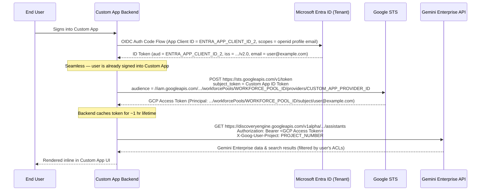

# Getting a Gemini Enterprise API token via Workforce Identity Federation (Microsoft Entra ID)

This guide is for an **end user or backend service** at a customer organization who wants to call the Gemini Enterprise (Discovery Engine) API directly — from a script, service, or custom application backend, with **no `gcloud` CLI or browser prompt required** — using an existing Microsoft Entra ID corporate identity, authenticated through Google Cloud's Workforce Identity Federation (WIF).

It covers **only how to obtain and use the token**, entirely headlessly, plus how a **custom application** where a user is already signed in via Entra ID SSO can reuse that exact authenticated session to call Gemini Enterprise on the user's behalf.

## Prerequisites (already done by your administrator)

Before you can follow this guide, your GCP/IT administrator must have already:

1. Created a **workforce identity pool** and a **workforce identity pool provider** configured for Microsoft Entra ID (OIDC), in the same GCP organization as the project that runs Gemini Enterprise.
2. Granted your Entra ID identity (directly or via a group) the IAM roles needed to call the Gemini Enterprise API (e.g. Discovery Engine roles) on the target project, plus `roles/serviceusage.serviceUsageConsumer` (or an equivalent role containing `serviceusage.services.use`) on the **workforce-pool user project**.
3. Given you the following values (they're customer-specific — nothing below is a working default):
   - `WORKFORCE_POOL_ID` — the workforce identity pool ID
   - `WORKFORCE_PROVIDER_ID` — the workforce identity pool provider ID
   - `WORKFORCE_POOL_USER_PROJECT` — the project number/ID used for quota and billing of your WIF sign-ins
   - `PROJECT_NUMBER` — the project number of the GCP project running Gemini Enterprise (used later as the API's quota project; may be the same as `WORKFORCE_POOL_USER_PROJECT`)
   - `ENGINE_ID` / `LOCATION` — the Gemini Enterprise engine/app you're calling

If any of these don't exist yet, this guide isn't for you — ask your administrator to complete Google's [Workforce Identity Federation setup for Microsoft Entra ID](https://cloud.google.com/iam/docs/workforce-sign-in-microsoft-entra-id) first.

## Step 1: Get an Entra ID OIDC ID token

Obtain an **Entra ID–issued OIDC `id_token`** representing the authenticated user — for example, from your application's OIDC sign-in session (`authorization_code` / PKCE flow), a silent `refresh_token` renewal, or an On-Behalf-Of (OBO) exchange. This step is entirely on the Entra ID side; Google is not involved yet. The result is a signed JWT (`id_token`).

> **Important (`id_token` vs. `access_token`):**
> - Always pass the **OIDC `id_token`** (or an OBO token explicitly minted for your target Entra App Client ID with v2.0 issuer `https://login.microsoftonline.com/<TENANT_ID>/v2.0`).
> - Do **not** pass a Microsoft Graph `access_token` (`aud: 00000003-0000-0000-c000-000000000000`), as its audience and v1.0 issuer (`https://sts.windows.net/<TENANT_ID>/`) will be rejected by Google STS.
> - Note that Entra ID's daemon `client_credentials` grant only issues app-only `access_token`s (with no user `id_token` or user email claims); to act as an end user and respect per-user Gemini Enterprise ACLs, use a delegated user flow (`authorization_code`, `refresh_token`, or `urn:ietf:params:oauth:grant-type:jwt-bearer` OBO).

## Step 2: Exchange it for a Google Cloud access token

POST the Entra ID ID token to Google's Security Token Service (STS) to exchange it for a short-lived Google Cloud access token:

```bash
curl https://sts.googleapis.com/v1/token \
    --data-urlencode "audience=//iam.googleapis.com/locations/global/workforcePools/WORKFORCE_POOL_ID/providers/WORKFORCE_PROVIDER_ID" \
    --data-urlencode "grant_type=urn:ietf:params:oauth:grant-type:token-exchange" \
    --data-urlencode "requested_token_type=urn:ietf:params:oauth:token-type:access_token" \
    --data-urlencode "scope=https://www.googleapis.com/auth/cloud-platform" \
    --data-urlencode "subject_token_type=urn:ietf:params:oauth:token-type:id_token" \
    --data-urlencode "subject_token=ENTRA_ID_OIDC_TOKEN" \
    --data-urlencode "options={\"userProject\":\"WORKFORCE_POOL_USER_PROJECT\"}"
```

Replace `ENTRA_ID_OIDC_TOKEN` with the JWT from Step 1, and the other placeholders with the values from [Prerequisites](#prerequisites-already-done-by-your-administrator).

The response looks like:

```json
{
  "access_token": "<GCP_ACCESS_TOKEN>",
  "issued_token_type": "urn:ietf:params:oauth:token-type:access_token",
  "token_type": "Bearer",
  "expires_in": 3600
}
```

`access_token` is your Google Cloud bearer token, valid for `expires_in` seconds (typically one hour). When it expires, repeat Step 1 and Step 2 with a fresh Entra ID ID token (e.g., obtained silently via your Entra `refresh_token`) — there is no `gcloud` session to refresh; every renewal is this same two-step exchange.

## Step 3: Call the Gemini Enterprise API

Call the Gemini Enterprise (Discovery Engine) API directly with the access token. Two headers are required:

- `Authorization: Bearer <access_token>`
- `X-Goog-User-Project: PROJECT_NUMBER` — **required explicitly.** A Workforce Identity Federation principal typically has no GCP project associated with its credentials (unlike a user or service-account identity), so the API call must specify the billing/quota project itself rather than relying on it being inferred from the token.

Example — listing assistants for an engine:

```bash
ACCESS_TOKEN="<access_token from Step 2>"

curl -X GET \
  -H "Authorization: Bearer ${ACCESS_TOKEN}" \
  -H "X-Goog-User-Project: PROJECT_NUMBER" \
  "https://discoveryengine.googleapis.com/v1alpha/projects/PROJECT_NUMBER/locations/LOCATION/collections/default_collection/engines/ENGINE_ID/assistants"
```

Substitute `PROJECT_NUMBER`, `LOCATION`, and `ENGINE_ID` with the values from [Prerequisites](#prerequisites-already-done-by-your-administrator). Any other Gemini Enterprise/Discovery Engine REST endpoint your Entra ID identity is authorized for follows the same pattern — same two headers, different URL and body.

## Cross-Application Access (e.g. Embedding Gemini Enterprise Data in Another App)

If a second application — say an internal portal or custom web app (`CUSTOM_APP`) — is federated through the **same Microsoft Entra ID tenant** and needs to query Gemini Enterprise on behalf of a signed-in user, **`CUSTOM_APP` can directly exchange the user's existing `CUSTOM_APP` Entra ID `id_token` for a GCP access token** with zero additional login prompts.

### Architecture & ID Correlation

Gemini Enterprise binds authentication at the **Workforce Pool level**, not the individual provider level (configured under *Gemini Enterprise > Settings > Authentication* as `locations/global/workforcePools/<WORKFORCE_POOL_ID>` in `IdpConfig.ExternalIdpConfig.workforce_pool_name`).

Because IAM permissions and Discovery Engine data store ACLs attach to the **workforce pool subject and group principals**:

```text
principal://iam.googleapis.com/locations/global/workforcePools/WORKFORCE_POOL_ID/subject/SUBJECT_VALUE
principalSet://iam.googleapis.com/locations/global/workforcePools/WORKFORCE_POOL_ID/group/GROUP_VALUE
```

Notice that the provider ID is **not** part of the resolved IAM principal URI. Therefore, you can register a second OIDC provider (`CUSTOM_APP_PROVIDER_ID`) inside the **same workforce pool** pointing to `CUSTOM_APP`'s Entra App Registration Client ID (`ENTRA_APP_CLIENT_ID_2`). As long as both providers map `google.subject` (and `google.groups`) to the exact same claims, any authenticated user resolves to the **exact same principal**, retaining all Gemini Enterprise IAM roles and document-level ACL access automatically.

| Layer | Gemini Enterprise Primary / Web App | Calling Application (e.g. `CUSTOM_APP`) |
| :--- | :--- | :--- |
| **Entra ID App Registration** | `ENTRA_APP_CLIENT_ID_1` (e.g. Gemini Enterprise) | `ENTRA_APP_CLIENT_ID_2` (e.g. `CUSTOM_APP`) |
| **Entra ID Issuer** | `https://login.microsoftonline.com/<TENANT_ID>/v2.0` | `https://login.microsoftonline.com/<TENANT_ID>/v2.0` *(Same)* |
| **Workforce Identity Pool** | `locations/global/workforcePools/WORKFORCE_POOL_ID` | `locations/global/workforcePools/WORKFORCE_POOL_ID` *(Same)* |
| **Workforce Identity Provider** | `providers/WORKFORCE_PROVIDER_ID_1` | `providers/CUSTOM_APP_PROVIDER_ID` |
| **Attribute Mapping** | `google.subject=assertion.email.lowerAscii()` | `google.subject=assertion.email.lowerAscii()` *(Must match Provider 1)* |
| **Resolved IAM Principal** | `principal://.../workforcePools/WORKFORCE_POOL_ID/subject/user@example.com` | `principal://.../workforcePools/WORKFORCE_POOL_ID/subject/user@example.com` *(Identical!)* |

---

### Administrator Setup: Adding Provider 2 to the Same Pool

Your GCP administrator creates the second provider inside the existing workforce pool using `gcloud` or Terraform:

```bash
gcloud iam workforce-pools providers create-oidc CUSTOM_APP_PROVIDER_ID \
    --workforce-pool="WORKFORCE_POOL_ID" \
    --location="global" \
    --display-name="Custom App Provider" \
    --description="Workforce provider for custom app cross-application access" \
    --issuer-uri="https://login.microsoftonline.com/TENANT_ID/v2.0" \
    --client-id="ENTRA_APP_CLIENT_ID_2" \
    --attribute-mapping="google.subject=assertion.email.lowerAscii(),google.display_name=assertion.name,google.groups=assertion.groups" \
    --web-sso-response-type="id-token" \
    --web-sso-assertion-claims-behavior="only-id-token-claims"
```

> **Configuration Notes for Provider 2:**
> 1. **Why `--web-sso-response-type="id-token"` and `--web-sso-assertion-claims-behavior="only-id-token-claims"`?**
>    Programmatic STS token exchange (`https://sts.googleapis.com/v1/token`) only inspects claims embedded directly inside the `id_token` JWT; it never calls the OIDC UserInfo endpoint. Using `id-token` / `only-id-token-claims` also avoids having to generate or store an OIDC `--client-secret-value` on the GCP Workforce Provider (which GCP requires if you select `code` flow).
> 2. **Match Provider 1's Exact Attribute Mapping:**
>    Inspect Provider 1 first (`gcloud iam workforce-pools providers describe WORKFORCE_PROVIDER_ID_1 --workforce-pool=WORKFORCE_POOL_ID --location=global`) and copy its exact `--attribute-mapping` expression (whether it uses `assertion.email.lowerAscii()`, `assertion.preferred_username`, `assertion.upn`, or `assertion.oid`).
> 3. **Ensure Required Claims Are Present in `CUSTOM_APP`'s `id_token`:**
>    - **`email` / `preferred_username`:** Ensure `CUSTOM_APP` requests the `openid profile email` scopes during Entra ID login so the `email` claim is emitted in the `id_token`.
>    - **`groups` (for Data Store ACLs & Group IAM):** In the Microsoft Entra admin center under **`ENTRA_APP_CLIENT_ID_2` > Token configuration > Add groups claim**, enable group claims on the ID token so `assertion.groups` is populated. *(If your organization has users in >200 groups and uses SCIM `--scim-usage=enabled-for-groups` or `--extra-attributes-type=azure-ad-groups-...` on Provider 1, mirror that same setting on Provider 2).*

---

### Cross-Application Call Flow


```mermaid
sequenceDiagram
    participant U as End User
    participant App as Custom App Backend
    participant E as Microsoft Entra ID (Tenant)
    participant S as Google STS
    participant G as Gemini Enterprise API

    U->>App: Signs into Custom App
    App->>E: OIDC Auth Code Flow (App Client ID = ENTRA_APP_CLIENT_ID_2, scopes = openid profile email)
    E-->>App: ID Token (aud = ENTRA_APP_CLIENT_ID_2, iss = .../v2.0, email = user@example.com)
    Note over App: Seamless — user is already signed into Custom App

    App->>S: POST https://sts.googleapis.com/v1/token<br/>subject_token = Custom App ID Token<br/>audience = //iam.googleapis.com/.../workforcePools/WORKFORCE_POOL_ID/providers/CUSTOM_APP_PROVIDER_ID
    S-->>App: GCP Access Token (Principal: .../workforcePools/WORKFORCE_POOL_ID/subject/user@example.com)
    Note over App: Backend caches token for ~1 hr lifetime

    App->>G: GET https://discoveryengine.googleapis.com/v1alpha/.../assistants<br/>Authorization: Bearer <GCP Access Token><br/>X-Goog-User-Project: PROJECT_NUMBER
    G-->>App: Gemini Enterprise data & search results (filtered by user's ACLs)
    App-->>U: Rendered inline in Custom App UI
```

### STS Call Example for Provider 2

```bash
curl https://sts.googleapis.com/v1/token \
    --data-urlencode "audience=//iam.googleapis.com/locations/global/workforcePools/WORKFORCE_POOL_ID/providers/CUSTOM_APP_PROVIDER_ID" \
    --data-urlencode "grant_type=urn:ietf:params:oauth:grant-type:token-exchange" \
    --data-urlencode "requested_token_type=urn:ietf:params:oauth:token-type:access_token" \
    --data-urlencode "scope=https://www.googleapis.com/auth/cloud-platform" \
    --data-urlencode "subject_token_type=urn:ietf:params:oauth:token-type:id_token" \
    --data-urlencode "subject_token=CUSTOM_APP_ENTRA_ID_TOKEN" \
    --data-urlencode "options={\"userProject\":\"WORKFORCE_POOL_USER_PROJECT\"}"
```

### Security Note: How STS Verifies the Caller (Asymmetric Signature & JWKS)

A common question is: *How does Google STS know the caller is genuinely that user without contacting Entra ID on every request?*

1. **Cryptographic Signing (Entra ID)**: When the user signs in, Microsoft Entra ID digitally signs the ID token using its private signing key.
2. **Public Key Discovery (JWKS)**: Google STS retrieves Entra ID's public keys from Microsoft's standard OIDC discovery endpoint (`https://login.microsoftonline.com/<TENANT_ID>/discovery/v2.0/keys`) and caches them.
3. **Tamper-Proof Verification**: During token exchange, STS validates:
   - **Signature**: Mathematically verified against Entra ID's cached public key (proving the token was genuinely minted by Microsoft and untampered).
   - **Issuer (`iss`)**: Matches the provider's configured `--issuer-uri`.
   - **Audience (`aud`)**: Matches the provider's configured `--client-id` (`ENTRA_APP_CLIENT_ID_2`).
   - **Expiration (`exp`)**: Ensures the token is currently valid.
4. **Safe Principal Resolution**: Once cryptographically verified, STS extracts the identity claim (e.g. `email` or `oid`) and maps it to the workforce pool principal.

### Alternative: Entra ID On-Behalf-Of (OBO) Flow (If Provider 2 Cannot Be Added)

If your organization's GCP policy prohibits creating a second provider in the workforce pool:
1. In Microsoft Entra ID, the primary Gemini Enterprise app registration (`ENTRA_APP_CLIENT_ID_1`) exposes an API scope (e.g. `api://<ENTRA_APP_CLIENT_ID_1>/user_impersonation`) and authorizes `ENTRA_APP_CLIENT_ID_2` (`CUSTOM_APP`) as a known client application (with `requestedAccessTokenVersion: 2` in the app manifest).
2. The custom app backend takes the user's incoming Entra ID token and invokes Entra ID's **On-Behalf-Of (OBO)** endpoint (`https://login.microsoftonline.com/<TENANT_ID>/oauth2/v2.0/token` with `grant_type=urn:ietf:params:oauth:grant-type:jwt-bearer`).
3. Entra ID mints a new v2.0 JWT with `aud = ENTRA_APP_CLIENT_ID_1` (matching the primary Gemini Enterprise app registration).
4. The custom app backend exchanges this OBO token against `WORKFORCE_PROVIDER_ID_1` with Google STS. Still zero user-facing prompts.

## Ending a session

There is no persistent Google-side session to revoke. Simply stop requesting new Entra ID ID tokens and let the last-issued Google Cloud access token expire (within `expires_in` seconds of the last exchange).

## Further reading

- [Obtain short-lived tokens for Workforce Identity Federation](https://cloud.google.com/iam/docs/workforce-obtaining-short-lived-credentials) (Google's canonical reference for the STS REST call above)
- [Configure Workforce Identity Federation with Microsoft Entra ID](https://cloud.google.com/iam/docs/workforce-sign-in-microsoft-entra-id) (administrator setup — not needed if your admin has already done this)